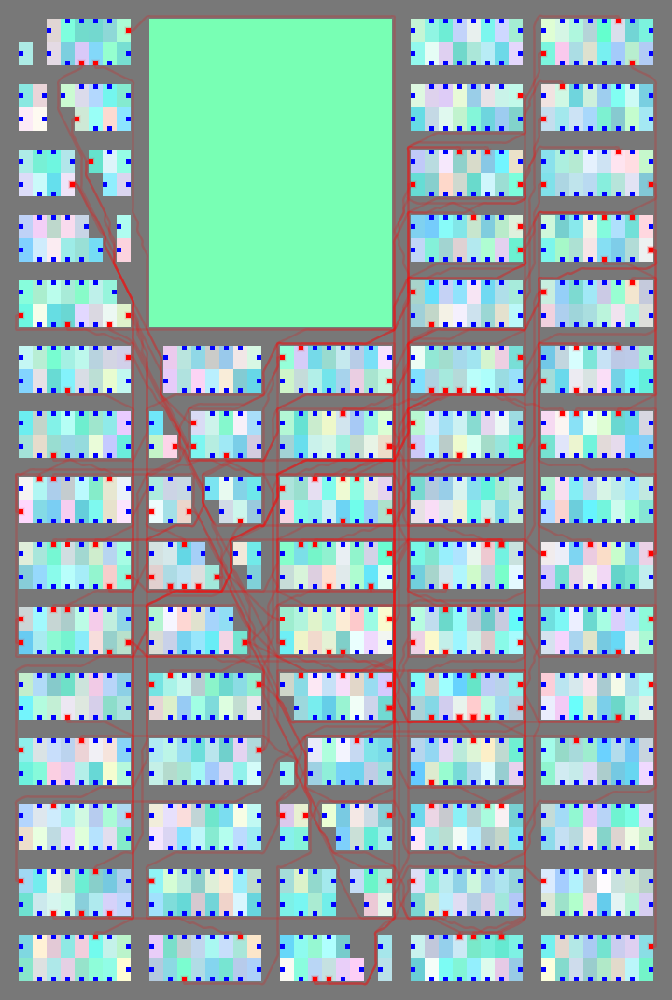
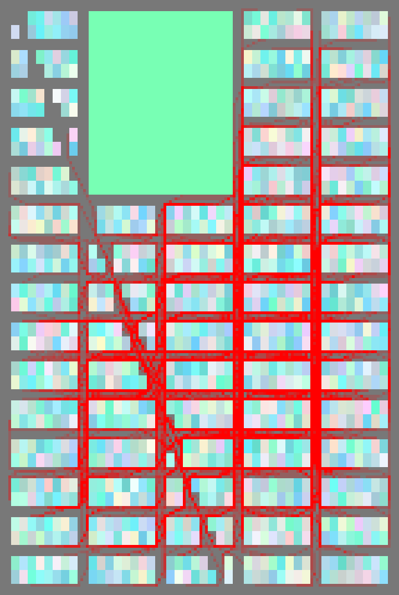
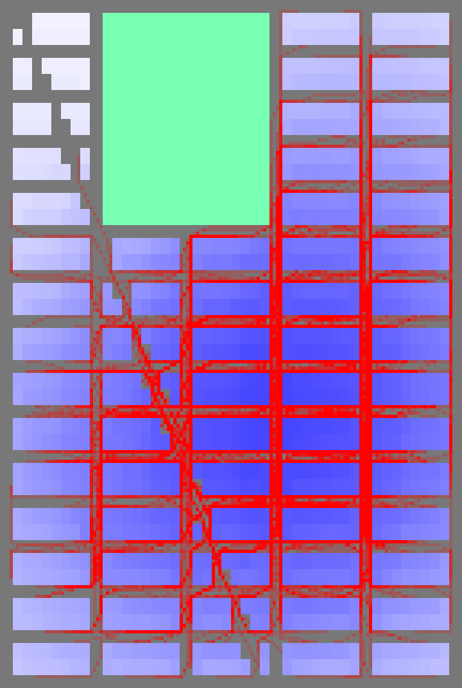
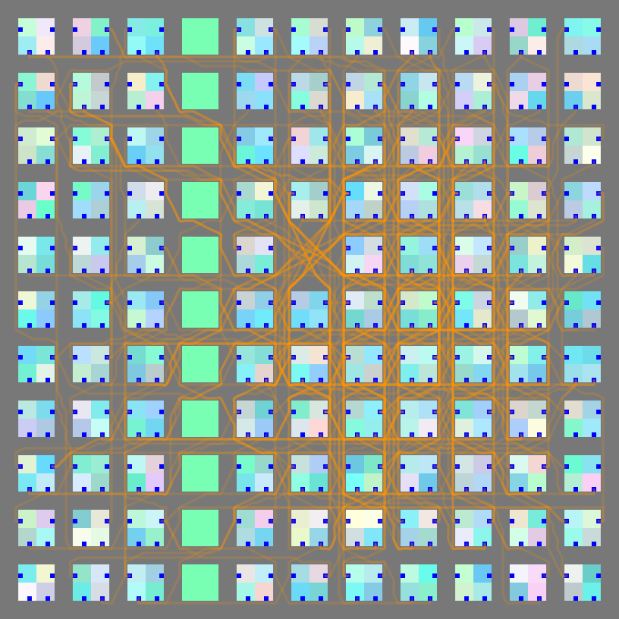
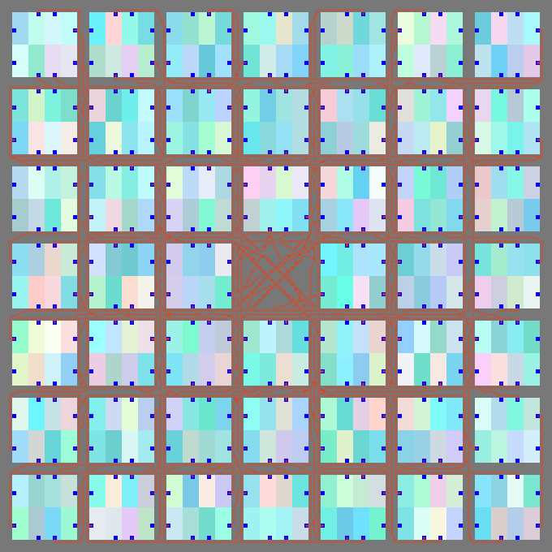
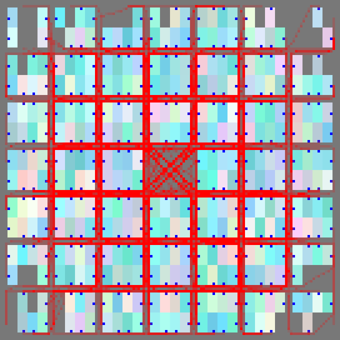
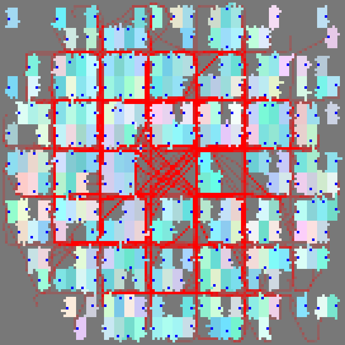
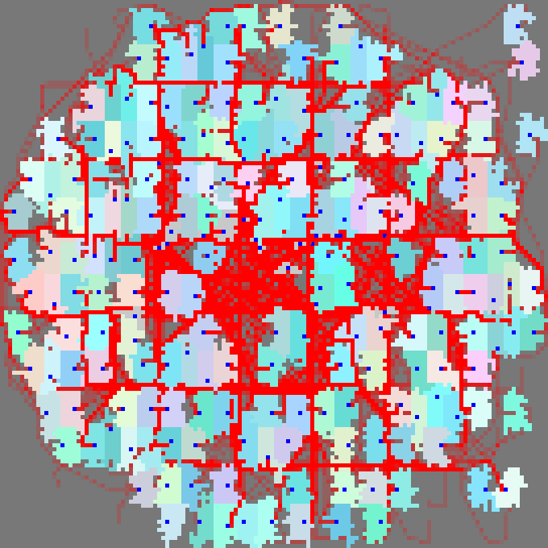
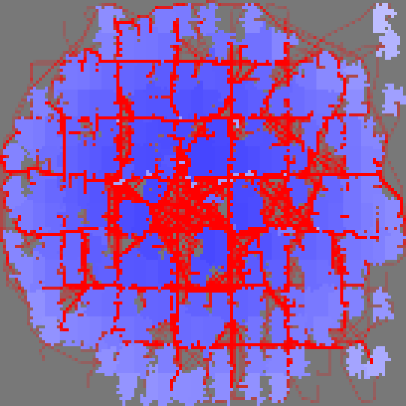

# Grids - Their Traffic Patterns and Erosion

**Richard Qian Li, 2023**

The study deals with two problems:

### 1. The Traffic Pattern in the Grids

Firstly, it simulates the spontaneous traffic patterns emerging within the grid, the value creation and growth patterns that arise in response to the spontaneous movements of inhabitants.

### 2. The Erosion of the Grids

Secondly, it delves into the grid's deterioration due to factors such as economic downturns or sociopolitical upheavals, highlighting the subsequent movement reorganization. Notably, informal occupations following these disturbances play a pivotal role in reshaping the city.

- [New York Type](scenes.html?scene=newYork) - long blocks with variation of large park and some diagonal street.
- [Portland Type](scenes.html?scene=portland) - square blocks with linear parks and small squares.
- [Lucca Type](scenes.html?scene=lucca) - Roman Age camp city with regular blocks and some open space.

### Installation and Usage

No installation is required. The code is hosted on GitHub Pages at [https://github.com/ludwigpeking/grid-erosion.git/](https://github.com/ludwigpeking/grid-erosion.git/). 
p5*js library is used in the project. The library is included in the project. The application can be run by opening the `index.html` file in a web browser.
From the index page, users have access to the scenes and descriptions.

### Parameters of the grid that can be changed in the scenes:

- Street Count: Number of streets (integer)
- Avenue Count: Number of avenues (integer)
- Street Width: Width of the streets (integer)
- Block Parcel Count: Number of parcels in a block (integer)
- Parcel Width: Width of a parcel (integer)
- Parcel Depth: Depth of a parcel (integer)
- Res: the resolution or the size of the tile that affects only viewing

### Growth events

- Add traffic and create prosperity to the grid

### Decline events

- Parcels destroyed randomly
- Parcels with low prosperity becomes vacant
- Overall prosperity declines 
- Overall traffic volume declines 

### Claimation events - spontaneous growth after the age of turmoil

- New users spawning at desirable location
- Properties claim space from open space of no owner

### The Author

The author is Richard Qian Li, an architect and urban designer who now resides in Beijing with his family.
Contact: ludwig.peking@gmail.com

### License

MIT License

Copyright (c) 2023, Richard Qian Li.

Permission is hereby granted, free of charge, to any person obtaining a copy of this software and associated documentation files (the "Software"), to deal in the Software without restriction, including without limitation the rights to use, copy, modify, merge, publish, distribute, sublicense, and/or sell copies of the Software, and to permit persons to whom the Software is furnished to do so, subject to the following conditions:

The above copyright notice and this permission notice shall be included in all copies or substantial portions of the Software.

THE SOFTWARE IS PROVIDED "AS IS", WITHOUT WARRANTY OF ANY KIND, EXPRESS OR IMPLIED, INCLUDING BUT NOT LIMITED TO THE WARRANTIES OF MERCHANTABILITY, FITNESS FOR A PARTICULAR PURPOSE AND NONINFRINGEMENT. IN NO EVENT SHALL THE AUTHORS OR COPYRIGHT HOLDERS BE LIABLE FOR ANY CLAIM, DAMAGES OR OTHER LIABILITY, WHETHER IN AN ACTION OF CONTRACT, TORT OR OTHERWISE, ARISING FROM, OUT OF OR IN CONNECTION WITH THE SOFTWARE OR THE USE OR OTHER DEALINGS IN THE SOFTWARE.
